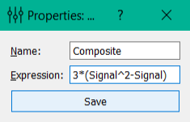

Composite signal settings
=========================

Composite signal settings include:

**Name**: name of the signal.

**Expression**: expression used to compute samples of the composite signal from samples of processed signal (as the name of the variables used the names of the processed signals; supported operations: +, -, *, /, ^ and brackets).