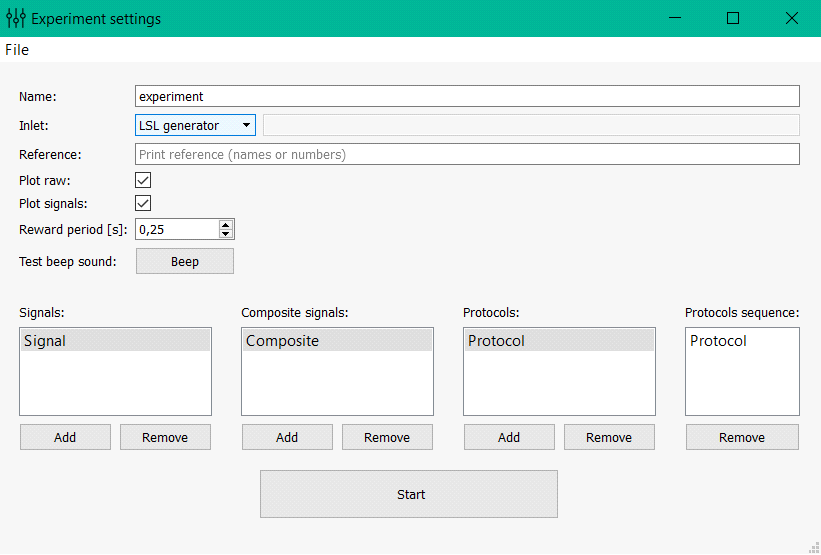

Experimental designer
=====================

This module allows you to configure the experiment design. Customized design is saved in an .xml file and can be
loaded with further use of the program. ‘Start’ button starts the module of carrying out experiments in which an
experiment is conducted with your settings.

Below is a simplified version that describes the basic settings of the experiment in order from top to bottom and left to right.

**Name**: the name of the experiment (in a folder ‘results’ there is a folder with the same name and added timestamp).

**Inlet**: selection of the data stream to which you want to connect. There is a choice of four options: Normal LSL stream (for connection of devices with LSL support), LSL generator (created LSL flow with a model signal for the test program), LSL from file (created LSL signal playback stream recorded in the file during the previous experiments), FieldTripBuffer (connection for FieldTripBuffer Protocol).

**Reference**: 
         **Exclude channels**: a list of channels that should not be taken into account when conducting the experiment (in the construction of spatial filters).
      
         **Substract channel from other**: a list of channels that will be subtracted from others.

**Plot raw**: disables / enables online drawing of raw signals.

**Plot signals**: disables / enables online drawing of processed signals.

**Plot source space**: disables / enables online drawing of spatially distributed signals.

**Show subject window**: disables / enables the window with messages or feedback presentation for a subject.

**Reward period**: the period of accrual encouragement (if the processed signal from the test exceeds a predetermined threshold, then the subject is beginning to accrued encouragement points with the given period).

**Test beep sound**: check of the sound stimulus.

**Enable DC-blocker**: disables / enables DC-blocker. Notice, DC-blocker applies to all raw data including EEG channels, photosensors, etc. 

**Show photo-sensor rect.**: enables / disables the rectangle at the bottom right of the screen during the experiment. Its brightness depends on the derived signal amplitude and imitate the feedback stimulus. It is used for computation of the latency (photo-sensor is needed).

**Signals**: configuration of the processed signals (such signals obtained from raw signals through the application of spatial filters, frequency filters, amplitudes calculation, subtracting the mean and dividing by the standard deviation, thus the smoothing is performed). When you double-click on one of the signals you open the composite signal settings:

.. toctree::
   signals

**Composite signals**: configurations of composite signals (samples of these signals are obtained by means of an algebraic expression of the signals samples from the field of “Signals”). When you double-click on one of the signals you open the settings of the composite signal:

.. toctree::
   composite

**Protocols**: includes settings of protocols (experiment consists of several protocols, each of which has a duration, settings of signal processing and rendering properties window for subject). When you double-click on one of the protocols you open protocol settings.

.. toctree::
   protocol
   
**Protocol groups**: inside a group it is possible to unite several blocks (protocols) in order to use them together in the general sequence. When you double-click on one of the groups you open the group settings where you can enter the blocks to add and their sequence within the group.

**Protocols sequence**: here you set the protocol sequence that will be implemented during the experiment (minutes can be dragged from the fields “Protocols” and “Protocol groups”).

The **Start** button starts the experiment.
