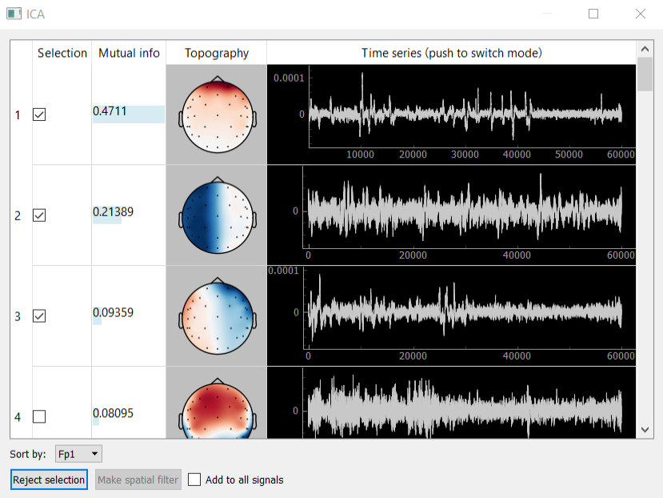

ICA
===

Method ICA (independent component analysis) is used to decompose the signal into independent components and is used
for the isolation and removal of various kinds of artifacts. Designed graphical interface to visualize and select the
component allows you to display the components themselves (column Time series), their spectra (column Time series
after clicking on the column header) and topography (Topography column), sort them by mutual information with a
certain channel. Calculations of the expansion are carried out using the ICA class of mne package. Buttons allow the
bottom panel to add to the signal bandstop filter for the artifact removal filter or to isolate any of the
components.

Example: removing eye artifacts
-------------------------------

One of the examples of the ICA application is to create a spatial filter, which allows you to remove eye artifacts.
The following describes a typical algorithm of this procedure:

    1. Data collection. To do this in one of the protocols (e.g. call it “Filters”) give to the subject the task “look at
    the screen” during the protocol and protocol settings, set the checkbox “Open signal manager in the end (SSD, CSP,
    ICA)”.

    2. ICA decomposition of the collected data. During the experiment, at the end of the protocol, at the time of opening
    the signals manager, necessary to select the signal to which you want to add eye filter, then click on the
    appropriate line of the open button from ICA column. Collected in the “Protocol Filters” multichannel data will be
    decomposed into n components by ICA (n - number of channels). Next window appears to visualize data components; in
    Figure 8 you could see an example.

    3. Selection of the artifact components. Further, necessary to note rows, those correspond to the components, which
    are observed eye artifacts. In the example of Figure 8 only one such component (first component).

    4. Creating a spatial bandstop filter. After selecting the components, that you want to exclude from the data, you
    must click “Reject selection”. For the selected signals will be created a spatial filter, which removes the selected
    ICA components. If you check the checkbox “add to all signals”, then the filter will be added to all derived signals.

    5. Continuation of the experiment. After closing signals manager in the real-time for selected derived signals will
    be applied a spatial filter, which removes the selected ICA components. Thus, in this example will be deleted
    subjects’ eye artifacts, during “Filters” protocol.

