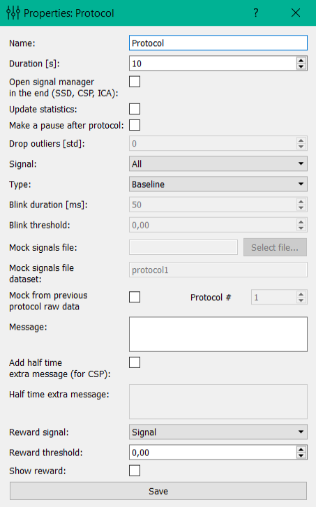

Protocol settings
=================

Protocol settings include:

**Name**: name of the protocol.

**Duration**: the duration of the protocol in seconds.

**Open signal manager in the end (SSD, CSP, ICA)**: opens at the end of protocol signaling manager where, by using different methods (SSD, CSP, ICA), computed spatial filters signals.

**Update statistics**: if this checkmark is exhibited, then, at the end of the protocol will be recalculated the average (mean) and standard deviation (std) of the signal, and subsequently from the signal will be subtracted mean and then the signal be divided by std.

**Type**: type of the protocol. Available 3 types of protocols: Baseline (on the screen of subject will be displayed a message, is used to collect data, to update the signal statistics, calculation of spatial filters, etc.), CircleFeedback (on the subjects screen will be displayed, with jagged edges, the degree of unevenness depends on the particular signal in the “Signal” (see previous paragraph.), the subjects task is to achieve complete smoothness of the edge of the circle), ThresholdBlink  (subjects screen at the time specified in paragraph “Blink duration” will turn white if the signal exceeds threshold defined in “Blink threshold”; this protocol is needed for measuring delays).

**Blink duration**: only available for ThresholdBlink protocol type (see above).

**Blink threshold**: only available for ThresholdBlink protocol type (see above).

**Mock signals file**: only available for FeedbackProtocol. Here you can specify the file from which to read the signal for FeedbackProtocol, recorded previously. This signal is false and will be changed at the time of the signal with the actual signal.

**Mock signals file dataset**: only available for FeedbackProtocol. Here specifies the protocol of the last experiment whose data is stored in a file specified by paragraph above. The signal recorded in this protocol will substitute the actual signal.

**Mock from previous protocol raw data**: only available for FeedbackProtocol. This sets an alternative method of signal substitution. Data for substitution are taken from the experiment itself (from the protocol which was previously, its number is indicated).

**Message**: Here you specify the message that will be displayed and presented to the subject.

**Add half time extra message (for CSP)**: if a tick is exhibited, then after half the time pass, a beep sounds will occur and message will change (additional message given by paragraph below).

**Half time extra message**: Additional message.

**Reward signal**: the signal that will be the basic for determining the awarding for subject.

**Reward threshold**: the threshold, above which will launch a counter points for subject award.

**Show reward**: if the user is exhibited the tick count points, awards will be presented.
