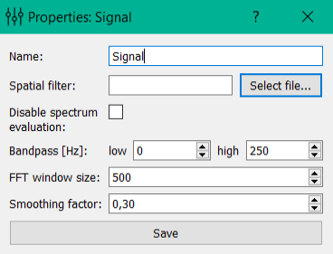

Derived signal settings
=======================

Signal Settings include:

**Name**: name of the signal.

**Spatial filter**: a spatial filter (a current signal sample is computed as a weighted sum of the raw samples, and that weights are construct the spatial filter)

**Disable spectrum evaluation**: disables the calculation of FFT and signal amplitude.

**Bandpass**: frequency filter border.
**FFT window size**: the size of the window in samples used for FFT.

**Smoothing factor**: factor used in the exponential smoothing.