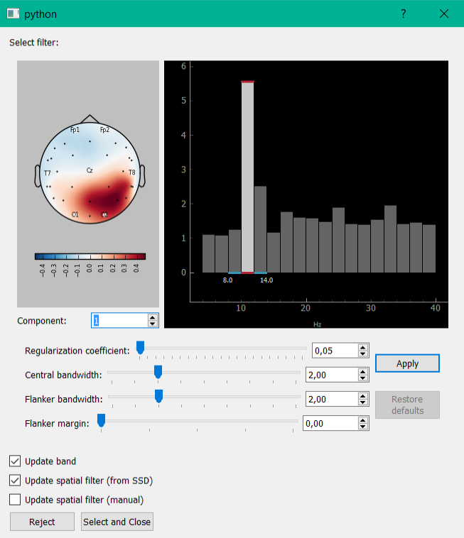

SSD
===

In the SSD method (spatio-spectral decomposition) decomposition also occurs by solving the generalized eigenvalue problem. This method allows you to select components with maximum signal power ratio for two different frequency bands (the central strip and the adjacent frequency). Implemented the possibility to partitioning the signal into strips, control their width. At the bottom, you allow to add to the bandstop filter signal from the selected filter components, or to isolate any of the components.
